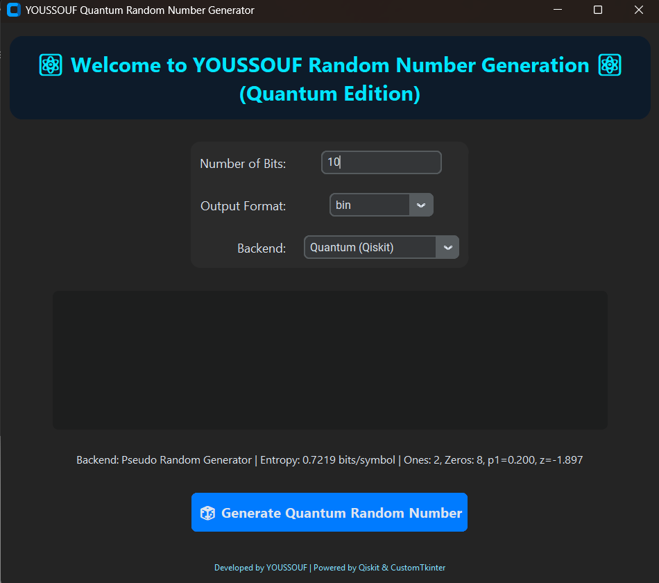

# ⚛ YOUSSOUF Quantum Random Number Generator (GUI Edition)

Welcome to the YOUSSOUF Quantum Random Number Generator!  
A modern, elegant GUI for generating true random numbers using **Quantum (Qiskit)** or **Pseudo-Random** backends.

---

## Features

- Generate truly random numbers using Quantum backend (Qiskit Aer Simulator)  
- Pseudo-random generator fallback for systems without Qiskit  
- Choose the number of bits to generate  
- Output in **binary** or **hexadecimal** format  
- Displays Shannon entropy and monobit test results  
- Elegant dark-themed GUI powered by CustomTkinter  
- Threaded generation for smooth interface performance  

---

## Screenshots

**Main GUI Interface:**  


**Random Number Generated (Binary Format):**  


**Random Number Generated (Hex Format):**  


> 💡 *Replace the above images with your actual screenshots in the `screenshots/` folder.*

---

## Installation

1. Install Python 3.10+  
2. Install dependencies:
```bash
pip install qiskit customtkinter
